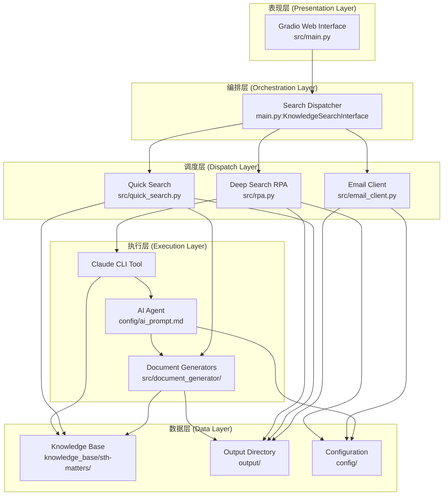
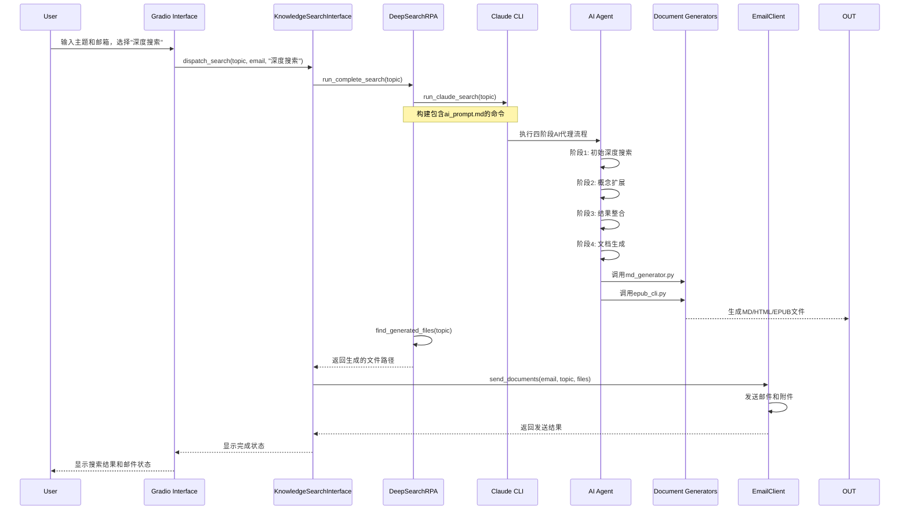
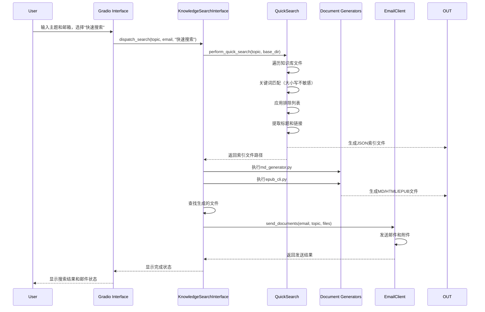
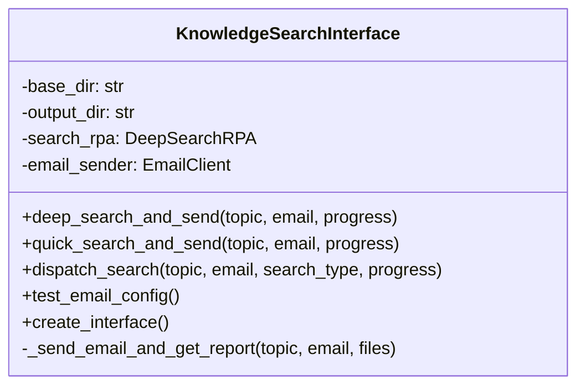
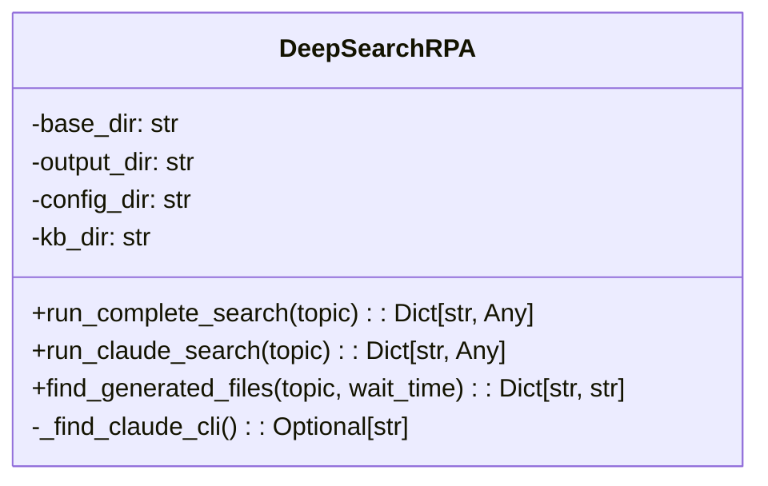
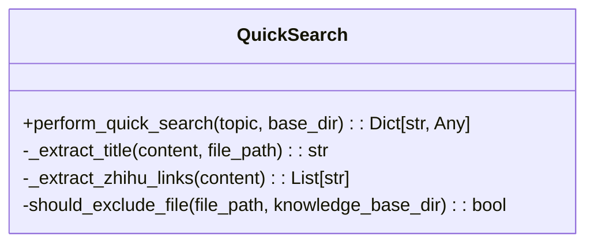
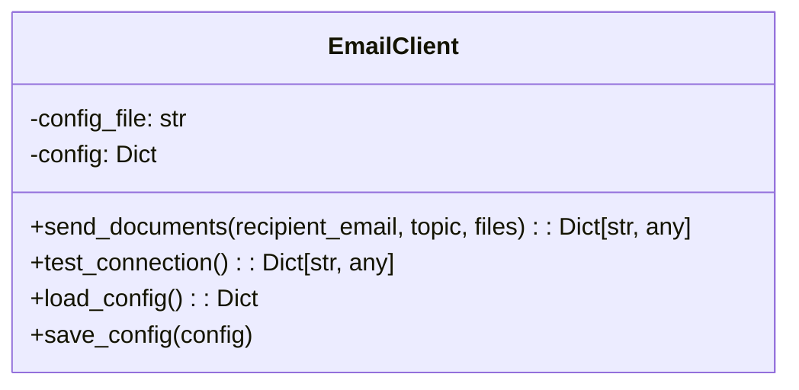
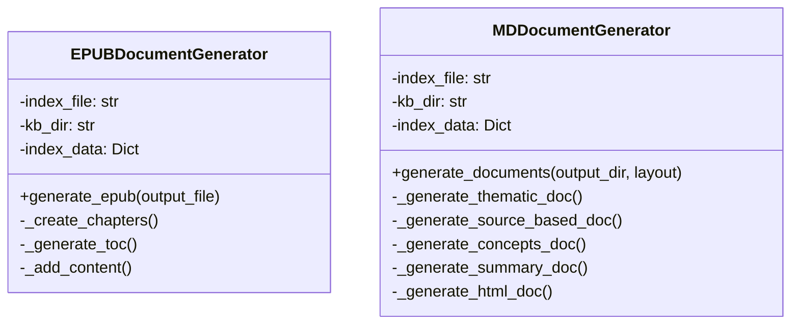
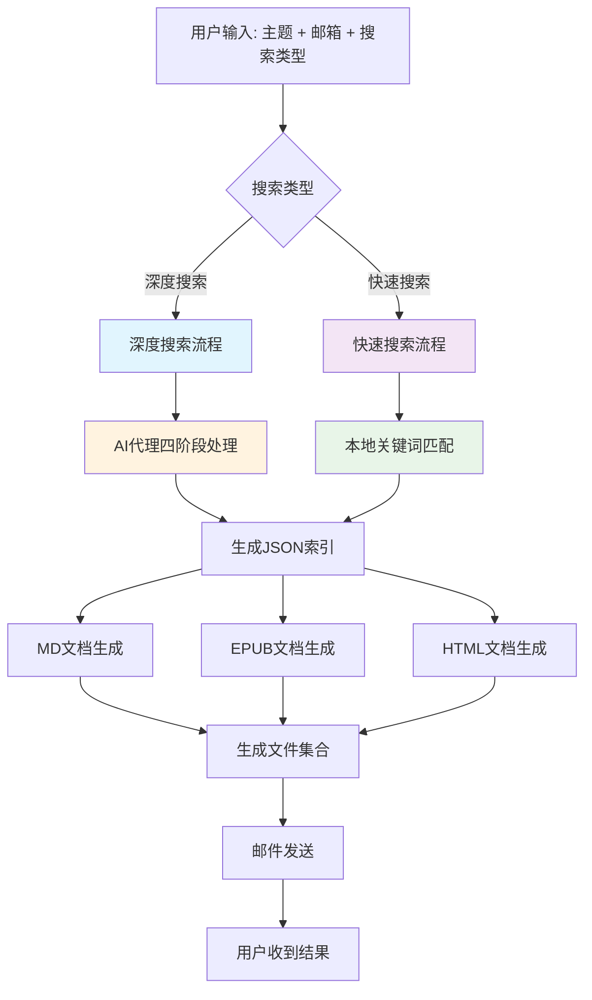

# Sth-Matters 系统架构分析文档

## 1. 系统概述

Sth-Matters 是一个AI代理驱动的知识合成系统，提供两种搜索模式：
- **深度搜索**：AI代理执行的四阶段深度分析和文档生成流程
- **快速搜索**：基于关键词的本地文件匹配搜索

## 2. 核心组件架构



## 3. 核心调用流程

### 3.1 深度搜索流程 (Deep Search Workflow)



### 3.2 快速搜索流程 (Quick Search Workflow)



## 4. 核心类详细设计

### 4.1 KnowledgeSearchInterface (src/main.py:25)



**职责**：
- 系统总指挥，协调各个组件
- 管理用户界面交互
- 路由不同搜索模式的调用

### 4.2 DeepSearchRPA (src/rpa.py:16)



**职责**：
- AI代理调度器
- 管理Claude CLI的执行
- 监控文档生成过程

### 4.3 快速搜索模块 (src/quick_search.py)



**职责**：
- 本地文件关键词搜索
- 文件过滤和排除
- JSON索引生成

### 4.4 EmailClient (src/email_client.py:19)



**职责**：
- SMTP邮件发送
- 附件处理
- 邮件配置管理

### 4.5 文档生成器 (src/document_generator/)



## 5. 数据流图



## 6. 关键配置文件

### 6.1 AI提示配置 (config/ai_prompt.md)

**核心内容**：
- 定义了AI代理的四阶段标准作业程序(SOP)
- 搜索策略和输出格式规范
- 文档生成工具调用指令

### 6.2 邮件配置 (config/email_config.json)

```json
{
  "smtp_server": "smtp.163.com",
  "smtp_port": 465,
  "sender_email": "daydreammy@163.com",
  "sender_password": "NUYQEBJEHZRHGLSI",
  "sender_name": "知识库搜索系统"
}
```

## 7. 文件结构

```
Sth-Matters/
├── src/
│   ├── main.py                    # Gradio界面和总调度器
│   ├── rpa.py                     # 深度搜索RPA
│   ├── quick_search.py           # 快速搜索模块
│   ├── email_client.py           # 邮件客户端
│   └── document_generator/       # 文档生成器
│       ├── __init__.py
│       ├── md_generator.py       # Markdown生成器
│       ├── epub_generator.py     # EPUB生成器
│       └── epub_cli.py          # EPUB命令行接口
├── config/
│   ├── ai_prompt.md              # AI代理提示配置
│   └── email_config.json         # 邮件配置
├── knowledge_base/
│   └── sth-matters/              # 知识库文件
├── output/                       # 生成文件输出
└── evaluate.py                   # 系统评估脚本
```

## 8. 系统特性

### 8.1 搜索模式对比

| 特性 | 深度搜索 | 快速搜索 |
|------|----------|----------|
| 执行时间 | 3-5分钟 | 秒级响应 |
| 搜索方式 | AI代理多阶段分析 | 关键词匹配 |
| 结果质量 | 高质量深度分析 | 表面匹配结果 |
| 资源消耗 | 高（AI调用） | 低（本地处理） |
| 适用场景 | 深度研究、未知主题 | 快速检索、已知主题 |

### 8.2 排除机制

快速搜索实现了智能排除功能：
- **系统文件排除**：过滤`.`开头的文件和目录
- **特定文件排除**：排除知识库根目录的README.md
- **路径安全**：防止访问系统敏感文件

### 8.3 错误处理机制

- **超时处理**：Claude CLI 30分钟超时
- **异常捕获**：各层级的异常处理和错误传播
- **状态反馈**：实时进度显示和详细错误信息
- **邮件重试**：SMTP连接失败自动重试机制

## 9. 性能和扩展性

### 9.1 性能瓶颈

- **深度搜索**：主要瓶颈在AI代理调用和文档生成
- **文件I/O**：大量文件读写操作
- **邮件发送**：大附件上传可能较慢

### 9.2 扩展点

- **新增搜索引擎**：可插拔的搜索模块设计
- **文档格式**：易于添加新的输出格式支持
- **AI代理**：可替换不同AI服务提供商
- **通知方式**：可扩展更多通知渠道

## 10. 安全考虑

- **路径遍历防护**：文件访问路径校验
- **输入验证**：用户输入参数校验
- **配置隔离**：敏感信息独立配置
- **权限控制**：最小权限原则设计

---

*本文档基于系统当前架构生成，如有代码更新请及时同步更新此文档。*